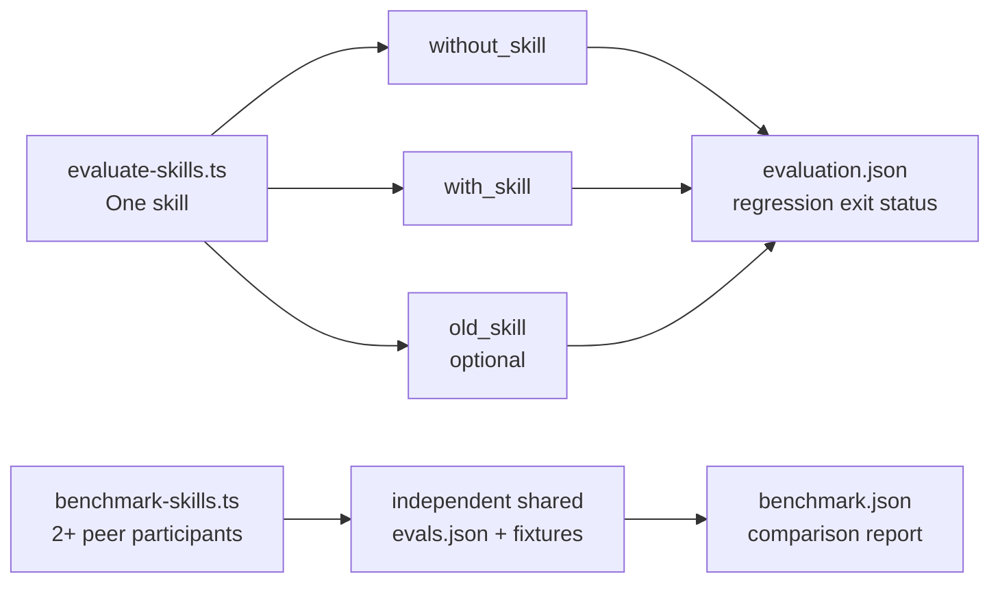

# Conrado's Agent Skills

Portable agent skills maintained by Conrado Quilles Gomes. Each skill is a
self-contained directory with its own `SKILL.md`, references, scripts, and
license information where applicable.

## Skills

| Skill | Category | Purpose |
|---|---|---|
| `chrome-devtools-wsl2` | General | Launch and attach Windows Chrome for browser automation from WSL2. |
| `council` | Adapted | Run a structured, delegated, multi-perspective council. |
| `user-trials` | General | Test products through grounded user personas operating browser, CLI, or API surfaces. |
| `git-user-activity-summary` | General | Summarize Git activity by repository across a folder tree. |
| `stress-test` | Adapted | Stress-test a plan, decision, design, or idea in sequential or batch mode. |
| `model-leaderboard-cost-benefit` | General | Rank current AI models by auditable capability and cost criteria. |
| `authoring-skills` | Adapted | Author and review portable Agent Skills against a shared rubric. |
| `brainstorm-ideas` | Adopted | Run Product Trio ideation and Opportunity Solution Tree discovery for new and existing products. Source: [borghei/Claude-Skills](https://github.com/borghei/Claude-Skills/tree/main/project-management/discovery/brainstorm-ideas). |
| `self-learning` | Adapted | Capture verified golden paths and delegate authoring to `authoring-skills`. |
| `what-if-oracle` | Adapted | Explore uncertain futures through structured multi-branch scenarios. |
| `ponytail-review` | Adapted | Review a diff exclusively for avoidable complexity. |
| `ponytail-audit` | Adapted | Audit a whole repository for avoidable complexity. |
| `ponytail-debt` | Adapted | Collect deliberate `ponytail:` deferrals into a debt ledger. |
| `code-review` | Adapted | Review the committed branch change as a pull request; publishes to Azure DevOps in CI and prints the same title, description, and findings locally. |

## Install

List the available skills without installing anything:

```bash
npx skills add conradoqg/agent-skills --list
```

Install all skills globally for Kiro CLI:

```bash
npx skills add conradoqg/agent-skills --skill '*' -g -a kiro-cli -y
```

Install selected skills for several agents:

```bash
npx skills add conradoqg/agent-skills \
  --skill council \
  --skill chrome-devtools-wsl2 \
  -g -a kiro-cli -a codex -a claude-code -y
```

Install from a local checkout while developing:

```bash
npx skills add . --list
npx skills add . --skill council -a kiro-cli -y
```

## Update and remove

```bash
npx skills check
npx skills update -g -y
npx skills remove council --global
```

## Requirements

- Node.js and `npx` for installation through the `skills` CLI.
- Skill-specific requirements are documented in each `SKILL.md`.
- `chrome-devtools-wsl2` requires WSL2, Windows Chrome, and `curl`.
- The leaderboard script uses Python 3 and the standard library only.

## Development

Run the repository checks:

```bash
python3 tests/validate_skills.py
python3 tests/test_model_ranking.py
bash tests/test_chrome_launcher.sh
bash tests/test_impact_map.sh
node tests/test_evaluate_skills.mjs
```

The checks are offline and do not modify installed agent configuration.

### Skill evaluations

The evaluation harness follows the Agent Skills `evals/evals.json` convention.
Its workflow is runtime-agnostic; it currently includes an isolated Codex CLI
runtime adapter and stores generated evidence outside the skill package:

```bash
node scripts/evaluate-skills.ts --skill authoring-skills
node scripts/evaluate-skills.ts --skill authoring-skills --previous /path/to/previous-snapshot
node scripts/benchmark-skills.ts --participant /tmp/brainstorm-ideas --participant /tmp/other-brainstorm --evals /path/to/shared-evals.json
# Repeat --eval to run selected manifest IDs only, in manifest order.
node scripts/evaluate-skills.ts --skill authoring-skills --eval migration-discovery
node scripts/benchmark-skills.ts --participant /tmp/brainstorm-ideas --participant /tmp/other-brainstorm --evals /path/to/shared-evals.json --eval migration-discovery --eval boundary-case
```

`evaluate-skills.ts` and `benchmark-skills.ts` deliberately answer different
questions:


Evaluation compares `without_skill` and `with_skill`; `--previous` adds
`old_skill` to detect regressions. Use `--variants with_skill` (or any subset) to
skip variants a given iteration is not comparing: while tuning a skill against a
fixed fixture, the baseline variant only costs runtime. Combine it with
`--grader none` when the decision rests on a hard gate such as SARIF matching
rather than on rubric scores. Its evidence is written under
`.skill-evals/` and the runner exits unsuccessfully when the candidate fails
or regresses. Benchmarking requires two or more `--participant` values and an
`--evals` suite outside every participant. It writes under
`.skill-benchmarks/`; every participant is a peer, and a failed rubric score
does not decide the process exit code (runtime failures still do).

Keep benchmark fixtures relative to the shared `evals.json`; declared `files`
are copied into every isolated run. An eval may instead declare
`workspace_zip` with a safe ZIP path: the runner checks archive entry paths,
extracts it with `unzip` into an isolated `inputs/workspace`, and uses that
workspace as the runtime CWD. This is generic; a code-review skill can infer
Git refs from a Git workspace, while another skill may use an ordinary project
archive. ZIP extraction therefore requires `unzip` on `PATH`.

An eval may require a SARIF result without exposing its reference answer to
the candidate:

```json
{
  "workspace_zip": "fixtures/review.zip",
  "sarif": {
    "artifact": "review.sarif",
    "ground_truth": "ground-truth/review.json",
    "gates": {
      "min_recall": 0.60,
      "min_recall_by_level": { "error": 0.80 },
      "max_false_positives": 5
    }
  }
}
```

The runner injects the exact artifact path and SARIF 2.1.0 result contract into the candidate prompt; participant skills do not need artifact instructions. Candidates may still give a normal user-facing final response. The runner
validates SARIF 2.1.0 and safe repository-relative locations, then independently
matches findings to private ground truth by defect mechanism and consequence.
It scores root-cause recall separately from strict path, line, and SARIF-level
agreement; candidate rule IDs do not decide semantic equivalence. SARIF is a
hard gate and is recorded in `grading.json` and the final report. Without
`gates`, every expected root cause must also meet the strict location/severity
criteria and no semantic false positive is allowed. Optional `gates` may set
`min_recall` and per-level `min_recall_by_level` thresholds from 0 to 1, plus a
non-negative integer `max_false_positives`; then misses are allowed only when
all declared gates pass. Reports preserve root and strict recall, recall by
level, exact-severity rate, false positives, semantic evidence, and failed
gates. Keep the ground truth outside `files` and never place it in a participant
skill.

The annotated ground-truth JSON must be the only place that knows the answer.
A fixture that marks its own defects — a `// finding:` comment, a giveaway file
or directory name, a defect-only path convention — measures grep, not review. A
useful review fixture instead makes impact depend on files the diff does not
touch, includes code that looks dangerous and is safe, keeps defects that
predate the base branch, and hides one defect that is introduced and reverted
inside the range. The `code-review` skill ships two built that way:
`evals/fixtures/build-large.mjs` and `evals/fixtures/build-polyglot.mjs` each
write their archive and their `ground-truth/*.json` in a single deterministic
pass, resolve every finding line by searching for the offending statement, and
refuse to finish when an anchor is ambiguous or when the archive contains
anything that looks like an answer key. Two runs produce a byte-identical
archive. Fixtures are static inputs: rebuild deliberately, never during an
evaluation.

The two are deliberately disjoint. One is TypeScript with its findings
concentrated in a single dense directory; the other is Python, Go, SQL, shell and
YAML with its findings spread about one per directory, drawn from defect classes
the first has no instance of. A change that helps on only one of them is fitted to
that one, which is the whole reason for keeping both.

The complete `code-review` tuning history—including iterations, metric-schema
boundaries, ground-truth corrections, failed approaches, token costs, handoff
changes, and the stopping rule—is maintained in
[`skills/code-review/evals/README.md`](skills/code-review/evals/README.md).

The runner supports authenticated Codex and Kiro CLIs; use `--grader none` to
capture runs without LLM assertion grading. Codex uses `codex exec --json`
automatically and records task and grader token usage when terminal JSONL
provides it. When terminal events carry unique IDs, the runner aggregates their
usage and reports `token_usage_scope`; otherwise it records the final root
event and labels it accordingly.

Every eval suite must declare a versioned `runtime_profile`, relative to its
`evals.json`. The bundled `local-code-review-v1` profile gives candidates an
isolated local workspace and graders read-only access; both adapters disable
MCP loading. Codex receives a fresh `CODEX_HOME` for every invocation (only
authentication is linked) and performs an MCP preflight. Kiro receives a fresh
`HOME` and generated agent with `mcpServers: {}` and `includeMcpJson: false`.
The resulting JSON and report record the profile hash, CLI/runtime policy,
fixture instruction hashes, and model provenance. `--model` remains optional
for Codex; when absent, the report explicitly labels the CLI default as
unattested rather than guessing its resolved model.

Both `evaluation.json` and `benchmark.json` also contain
`standardized_output` (schema version 1). It is the stable caller-facing
envelope: `variant_results` has status, runtime/profile, aggregate scores,
SARIF, token and duration metrics, and artifact paths for every variant.
`comparison` supplies deltas against `without_skill` when available (or
`old_skill` otherwise). The detailed `results` array remains the audit record
and preserves each agent's original output.

Kiro runs invoke exactly `kiro-cli chat --no-interactive --wrap never` plus any
configured `--agent` and `--effort`, for example:

```bash
node scripts/evaluate-skills.ts --skill authoring-skills --runtime kiro \
  --kiro-bin kiro-cli --kiro-agent kiro_default --kiro-effort high \
  --kiro-model claude-sonnet-5 --kiro-trust-tools fs_read,fs_write
```

Kiro defaults to `claude-sonnet-5` (verified against the available Kiro CLI model configuration) and always receives `--model`; override it with `--kiro-model <name>`. `--model` remains Codex-only.

Prefer `--kiro-agent-file <path>` over `--kiro-agent <name>` for benchmarking: the
runner then builds an isolated Kiro `HOME` per run containing only that agent, so no
global `mcp.json`, steering document, or installed skill can reach a candidate.
`agents/kiro-isolated.json` is the versioned profile for that purpose.
Authentication is preserved by linking the existing XDG data directory. This matters
for correctness as well as neutrality: loading the global MCP set grew `kiro-cli` to
about 29GB RSS locally until an OOM killer terminated runs mid-review.

```bash
node scripts/evaluate-skills.ts --skill code-review --runtime kiro \
  --kiro-agent-file agents/kiro-isolated.json \
  --kiro-model claude-sonnet-5 --kiro-effort high --kiro-trust-all-tools \
  --timeout-ms 1800000
```

Kiro has no documented JSON/token telemetry: the runner preserves stdout/stderr
logs and duration, and writes every token field as `null` with
`token_usage_scope: "unavailable"`. Candidate output is captured from stdout.
For grading, the runner writes `grader-output/grader-prompt.md`; Kiro must read
it and write strict JSON to the exact `grader-output/grader-response.json` path.
The runner parses that file rather than stdout, so tool narration in stdout is
preserved as evidence without corrupting grading. A missing or invalid response
file fails the criterion normally. Kiro requires an explicit headless
trust policy: pass exactly one of `--kiro-trust-tools <names>` (including an
explicit empty list when appropriate) or `--kiro-trust-all-tools`. It never
defaults to trusting all tools; use the latter only when the evaluation is
isolated and you intentionally accept that broader permission.

Assertions can declare
a `criterion`, a 0-10 `threshold`, and a `rubric` with anchored score
descriptions; the harness calculates pass/fail from `score >= threshold` and
retains the score and evidence in `grading.json`.

#### Conversational brainstorming evaluations

An eval can add `conversation` and `repetitions` to measure discovery during a
controlled dialogue. The participant profile belongs to the benchmark (it is
not a skill or a Council persona): it describes a role, goal, response style,
public facts, and facts that are only revealed when the candidate asks about
the specified subject. The simulator, candidate, and grader run in separate
contexts; unrevealed hidden facts are not put in the candidate prompt or
transcript. The
runtime receives a temporary copy of the skill with `evals/` removed, so a
manifest cannot leak hidden benchmark facts through the source skill directory.

```json
{
  "id": "migration-discovery",
  "prompt": "Help me brainstorm a safer onboarding migration.",
  "expected_output": "A grounded set of options and next validation step.",
  "repetitions": 3,
  "conversation": {
    "max_turns": 5,
    "persona": {
      "role": "technical stakeholder",
      "goal": "avoid operational risk",
      "style": "brief and cautious",
      "public_facts": ["The migration affects a small team."],
      "hidden_facts": [
        {
          "id": "migration-window",
          "fact": "The migration must finish in three weeks.",
          "reveal_when": "asked about timeline or migration constraints"
        }
      ]
    }
  },
  "assertions": []
}
```

For conversations, each result keeps `transcript.json` and a discovery summary
with the hidden fact ids actually revealed. `evaluation.json` and
`benchmark.json` aggregate those metrics per variant or participant
(`conversation_runs`, revealed/available facts, and `discovery_rate`) alongside
pass rate, rubric scores, and token use. Keep the
same scenario, persona, turn limit, and repetitions for every competing skill;
use a separate holdout set of profiles before changing a skill based on results.
Use `required_hidden_fact_ids` when a fact must be discovered for a run to pass;
otherwise discovery remains diagnostic. For cost-controlled pilots, pass
`--max-repetitions 1 --max-turns 2`; the runner prints progress for every
case/variant. Conversations may be configured for up to 30 turns. Each
iteration contains `transcripts/index.md`, with one organized copy of every
conversational transcript for review. When an eval declares required hidden
facts, the runner requests a final synthesis as soon as all of them are
discovered. It also ends after two consecutive turns without a newly revealed
fact; the turn limit remains the ceiling when discovery keeps advancing.
Hidden facts may declare `weight` from 1–5. Required facts are pass/fail safety
gates; weighted discovery remains diagnostic. `report.md` summarizes scores,
discovery, token usage, and executed candidate turns per variant.

Runs are sequential by default for the most stable runtime conditions. Pass
`--concurrency 2` or another bounded positive integer to execute independent
case/repetition/variant runs in parallel; result ordering remains deterministic.
Codex honors the requested concurrency. Kiro candidates are deliberately
serialized even when `--concurrency` is higher: the CLI persists shared local
session state and parallel candidates have terminated before artifact persistence.

For a new skill, add at least two realistic cases and one boundary case. Before
a material skill update, snapshot the existing skill outside the repository and
run the three-way comparison:

```bash
cp -R skills/<skill-name> /tmp/<skill-name>-previous
node scripts/evaluate-skills.ts --skill <skill-name> --previous /tmp/<skill-name>-previous
```

The evaluation and benchmark reports separate task and grader token use. A skill must meet every
criterion's threshold; average score is diagnostic only. The complete workflow
for agents is in [AGENTS.md](AGENTS.md). LLM-based evaluation is deliberately
local for now, not a CI requirement.

## Attribution

The `council` skill is adapted from
[`tsenart/council-skill`](https://github.com/tsenart/council-skill). See
[`THIRD_PARTY_NOTICES.md`](THIRD_PARTY_NOTICES.md) and the license bundled with
that skill.

`authoring-skills` and `self-learning` are adapted from work by
[`kulaxyz`](https://github.com/kulaxyz/self-learning-skills). The three
`ponytail-*` companion skills are adapted from
[`DietrichGebert/ponytail`](https://github.com/DietrichGebert/ponytail).

## License

Original work in this repository is licensed under the MIT License. Adapted
third-party work remains subject to its bundled license and attribution.
