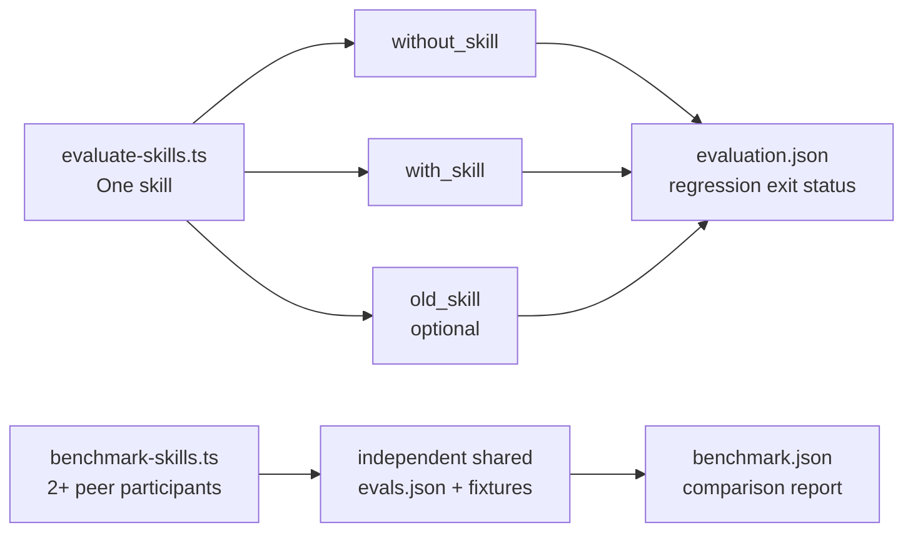

# Conrado's Agent Skills

Portable agent skills maintained by Conrado Quilles Gomes. Each skill is a
self-contained directory with its own `SKILL.md`, references, scripts, and
license information where applicable.

## Skills

| Skill | Category | Purpose |
|---|---|---|
| `chrome-devtools-wsl2` | General | Launch and attach Windows Chrome for browser automation from WSL2. |
| `council` | Adapted | Run a structured, delegated, multi-perspective council. |
| `git-user-activity-summary` | General | Summarize Git activity by repository across a folder tree. |
| `stress-test` | Adapted | Stress-test a plan, decision, design, or idea in sequential or batch mode. |
| `model-leaderboard-cost-benefit` | General | Rank current AI models by auditable capability and cost criteria. |
| `authoring-skills` | Adapted | Author and review portable Agent Skills against a shared rubric. |
| `brainstorm-ideas` | Adopted | Run Product Trio ideation and Opportunity Solution Tree discovery for new and existing products. Source: [borghei/Claude-Skills](https://github.com/borghei/Claude-Skills/tree/main/project-management/discovery/brainstorm-ideas). |
| `self-learning` | Adapted | Capture verified golden paths and delegate authoring to `authoring-skills`. |
| `what-if-oracle` | Adapted | Explore uncertain futures through structured multi-branch scenarios. |
| `ponytail-review` | Adapted | Review a diff exclusively for avoidable complexity. |
| `ponytail-audit` | Adapted | Audit a whole repository for avoidable complexity. |
| `ponytail-debt` | Adapted | Collect deliberate `ponytail:` deferrals into a debt ledger. |

## Install

List the available skills without installing anything:

```bash
npx skills add conradoqg/agent-skills --list
```

Install all skills globally for Kiro CLI:

```bash
npx skills add conradoqg/agent-skills --skill '*' -g -a kiro-cli -y
```

Install selected skills for several agents:

```bash
npx skills add conradoqg/agent-skills \
  --skill council \
  --skill chrome-devtools-wsl2 \
  -g -a kiro-cli -a codex -a claude-code -y
```

Install from a local checkout while developing:

```bash
npx skills add . --list
npx skills add . --skill council -a kiro-cli -y
```

## Update and remove

```bash
npx skills check
npx skills update -g -y
npx skills remove council --global
```

## Requirements

- Node.js and `npx` for installation through the `skills` CLI.
- Skill-specific requirements are documented in each `SKILL.md`.
- `chrome-devtools-wsl2` requires WSL2, Windows Chrome, and `curl`.
- The leaderboard script uses Python 3 and the standard library only.

## Development

Run the repository checks:

```bash
python3 tests/validate_skills.py
python3 tests/test_model_ranking.py
bash tests/test_chrome_launcher.sh
node tests/test_evaluate_skills.mjs
```

The checks are offline and do not modify installed agent configuration.

### Skill evaluations

The evaluation harness follows the Agent Skills `evals/evals.json` convention.
Its workflow is runtime-agnostic; it currently includes an isolated Codex CLI
runtime adapter and stores generated evidence outside the skill package:

```bash
node scripts/evaluate-skills.ts --skill authoring-skills
node scripts/evaluate-skills.ts --skill authoring-skills --previous /path/to/previous-snapshot
node scripts/benchmark-skills.ts --participant /tmp/brainstorm-ideas --participant /tmp/other-brainstorm --evals /path/to/shared-evals.json
```

`evaluate-skills.ts` and `benchmark-skills.ts` deliberately answer different
questions:



Evaluation compares `without_skill` and `with_skill`; `--previous` adds
`old_skill` to detect regressions. Its evidence is written under
`.skill-evals/` and the runner exits unsuccessfully when the candidate fails
or regresses. Benchmarking requires two or more `--participant` values and an
`--evals` suite outside every participant. It writes under
`.skill-benchmarks/`; every participant is a peer, and a failed rubric score
does not decide the process exit code (runtime failures still do).

Keep benchmark fixtures relative to the shared `evals.json`; they are copied
into every isolated run. The runner needs an authenticated Codex CLI; use
`--grader none` to capture runs without LLM assertion grading. Each run records
task and grader token usage separately when the runtime provides it. `codex
exec --json` is enabled automatically for this purpose. Assertions can declare
a `criterion`, a 0-10 `threshold`, and a `rubric` with anchored score
descriptions; the harness calculates pass/fail from `score >= threshold` and
retains the score and evidence in `grading.json`.

#### Conversational brainstorming evaluations

An eval can add `conversation` and `repetitions` to measure discovery during a
controlled dialogue. The participant profile belongs to the benchmark (it is
not a skill or a Council persona): it describes a role, goal, response style,
public facts, and facts that are only revealed when the candidate asks about
the specified subject. The simulator, candidate, and grader run in separate
contexts; unrevealed hidden facts are not put in the candidate prompt or
transcript. The
runtime receives a temporary copy of the skill with `evals/` removed, so a
manifest cannot leak hidden benchmark facts through the source skill directory.

```json
{
  "id": "migration-discovery",
  "prompt": "Help me brainstorm a safer onboarding migration.",
  "expected_output": "A grounded set of options and next validation step.",
  "repetitions": 3,
  "conversation": {
    "max_turns": 5,
    "persona": {
      "role": "technical stakeholder",
      "goal": "avoid operational risk",
      "style": "brief and cautious",
      "public_facts": ["The migration affects a small team."],
      "hidden_facts": [
        {
          "id": "migration-window",
          "fact": "The migration must finish in three weeks.",
          "reveal_when": "asked about timeline or migration constraints"
        }
      ]
    }
  },
  "assertions": []
}
```

For conversations, each result keeps `transcript.json` and a discovery summary
with the hidden fact ids actually revealed. `evaluation.json` and
`benchmark.json` aggregate those metrics per variant or participant
(`conversation_runs`, revealed/available facts, and `discovery_rate`) alongside
pass rate, rubric scores, and token use. Keep the
same scenario, persona, turn limit, and repetitions for every competing skill;
use a separate holdout set of profiles before changing a skill based on results.
Use `required_hidden_fact_ids` when a fact must be discovered for a run to pass;
otherwise discovery remains diagnostic. For cost-controlled pilots, pass
`--max-repetitions 1 --max-turns 2`; the runner prints progress for every
case/variant. Conversations may be configured for up to 30 turns. Each
iteration contains `transcripts/index.md`, with one organized copy of every
conversational transcript for review. When an eval declares required hidden
facts, the runner requests a final synthesis as soon as all of them are
discovered. It also ends after two consecutive turns without a newly revealed
fact; the turn limit remains the ceiling when discovery keeps advancing.
Hidden facts may declare `weight` from 1–5. Required facts are pass/fail safety
gates; weighted discovery remains diagnostic. `report.md` summarizes scores,
discovery, token usage, and executed candidate turns per variant.

Runs are sequential by default for the most stable runtime conditions. Pass
`--concurrency 2` or another bounded positive integer to execute independent
case/repetition/variant runs in parallel; result ordering remains deterministic.
Use a modest value (typically 2–3) to avoid runtime saturation or adding load
variation to the comparison.

For a new skill, add at least two realistic cases and one boundary case. Before
a material skill update, snapshot the existing skill outside the repository and
run the three-way comparison:

```bash
cp -R skills/<skill-name> /tmp/<skill-name>-previous
node scripts/evaluate-skills.ts --skill <skill-name> --previous /tmp/<skill-name>-previous
```

The evaluation and benchmark reports separate task and grader token use. A skill must meet every
criterion's threshold; average score is diagnostic only. The complete workflow
for agents is in [AGENTS.md](AGENTS.md). LLM-based evaluation is deliberately
local for now, not a CI requirement.

## Attribution

The `council` skill is adapted from
[`tsenart/council-skill`](https://github.com/tsenart/council-skill). See
[`THIRD_PARTY_NOTICES.md`](THIRD_PARTY_NOTICES.md) and the license bundled with
that skill.

`authoring-skills` and `self-learning` are adapted from work by
[`kulaxyz`](https://github.com/kulaxyz/self-learning-skills). The three
`ponytail-*` companion skills are adapted from
[`DietrichGebert/ponytail`](https://github.com/DietrichGebert/ponytail).

## License

Original work in this repository is licensed under the MIT License. Adapted
third-party work remains subject to its bundled license and attribution.
